<div align="center">

# 🧠🤝 Human-Informed Neural Networks (HINNs)

### *Trust-Adaptive Learning with Expert Guidance*

**When should a neural network listen to a human — and when should it stop?**

[](https://www.python.org/)
[](https://numpy.org/)
[](LICENSE)
[](#-project-status)
[](https://doi.org/10.1007/s44230-026-00173-2)
[](https://doi.org/10.1007/s44230-026-00173-2)

[**Overview**](#-overview) •
[**Architecture**](#%EF%B8%8F-architecture) •
[**Results**](#-results-at-a-glance) •
[**Quick Start**](#-quick-start) •
[**Gallery**](#%EF%B8%8F-figure-gallery) •
[**Math**](#-mathematical-overview) •
[**Citation**](#-citation)

<br>

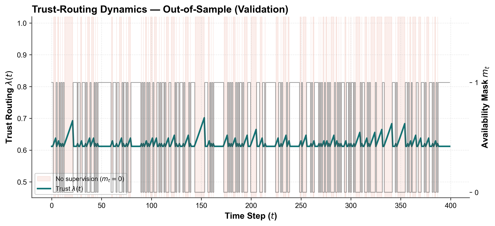

<sub><i>Trust routing λ(t) on out-of-sample AAPL data. While human supervision is missing (shaded), trust shifts back toward the data pathway. When fresh guidance arrives, it snaps back to the human-informed regime.</i></sub>

</div>

---

<table>
<tr>
<td>

### 📌 Please cite this work

If you use, adapt, extend, benchmark, or redistribute this software, please cite:

> **Mohammad (Behdad) Jamshidi**, "Human-Informed Neural Networks (HINNs): Trust-Adaptive Learning with Expert Guidance," *Human-Centric Intelligent Systems*, 2667-1336, 2026. DOI: [10.1007/s44230-026-00173-2](https://doi.org/10.1007/s44230-026-00173-2)

**Author:** Mohammad (Behdad) Jamshidi<br>
**Affiliation:** School of Electrical, Mechanical and Biomedical Engineering, University of Technology Sydney, Sydney, Australia<br>
**Contact:** mohammad.jamshidi@alumni.uts.edu.au<br>
**DOI:** [10.1007/s44230-026-00173-2](https://doi.org/10.1007/s44230-026-00173-2)<br>
**BibTeX:** see the [Citation](#-citation) section.

</td>
</tr>
</table>

---

## 🔭 Overview

**Human-Informed Neural Networks (HINNs)** is a lightweight, dual-pathway learning framework for sequential decision problems where human supervision is **valuable but intermittent, noisy, or drifting**.

<table>
<tr>
<td width="33%" align="center">

### ⚙️ Machine pathway
A **deterministic RNN** learns temporal structure directly from observed data.

</td>
<td width="33%" align="center">

### 👤 Human pathway
A **variational Bayesian NN** models human-aligned supervisory signals *and their uncertainty*.

</td>
<td width="33%" align="center">

### ⚖️ Trust function
A **time-sensitive trust coefficient λ(t)** weighs the two pathways by *recency* and *posterior confidence*.

</td>
</tr>
</table>

> 💡 **The core idea:** when human guidance is **recent and confident**, the human pathway gets more weight. When guidance goes **stale or uncertain**, HINN falls back toward data-driven learning.

The repository contains a NumPy reference implementation, a controlled synthetic experiment, ablation baselines, extensive diagnostics, and a **43-year real-world AAPL volatility-risk case study**.

> [!WARNING]
> This is research software. It is not financial, medical, legal, or other professional advice. Do not use it as a production decision system without independent validation, governance, and domain-specific review.

---

## ❓ Why HINN?

Purely data-driven objectives may not capture expert knowledge, policy requirements, behavioural preferences, or changing operational constraints. Human feedback has its own problems: it can be **sparse, inconsistent, delayed, or wrong**. HINN sits between these extremes and uses human supervision **without assuming it is always available or always trustworthy**.

| Design goal | How HINN delivers it |
|:---|:---|
| 🔀 **Adaptive human–machine balance** | A dynamic trust weight λ(t) instead of a fixed supervision coefficient |
| 🎲 **Uncertainty-aware guidance** | A variational Bayesian supervisory pathway with posterior variance |
| 🛟 **Graceful fallback** | Trust decays toward autonomous learning when supervision degrades |
| 🔍 **Transparency** | Pure NumPy with explicit recurrent updates and hand-written BPTT |
| 🔁 **Reproducibility** | Seeded, chronologically split synthetic and real-data workflows |

**Target domains:** financial risk assessment · clinical decision support · governance analytics · education · policy-sensitive automation.

---

## 🏗️ Architecture

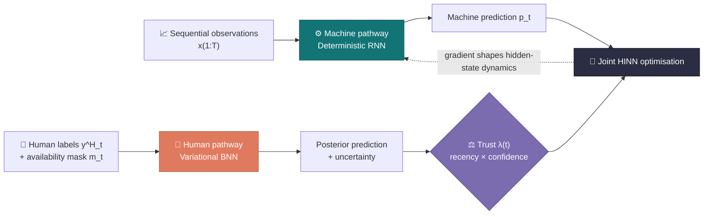

The human-aligned loss reaches the recurrent representation through the **machine prediction**. Human supervision therefore shapes hidden-state dynamics via the joint gradient, with no need to assume a human target for an uninterpretable hidden state.

<div align="center">
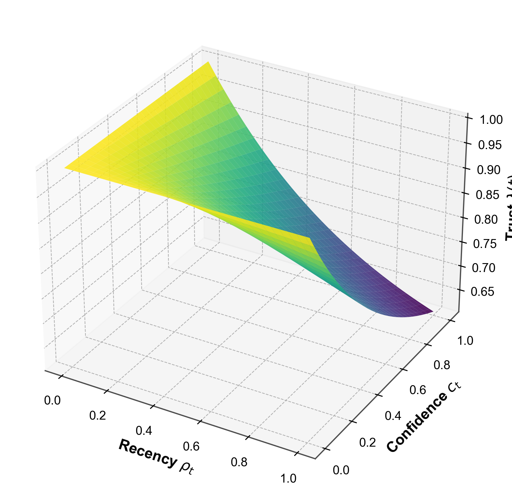

<sub><i><b>The trust surface.</b> λ(t) as a function of recency ρ<sub>t</sub> and confidence c<sub>t</sub>. Guidance that is both fresh and confident pulls λ toward its floor (more human weight). If either factor fades, trust returns to the machine pathway.</i></sub>
</div>

---

## 📊 Results at a Glance

### Real-world AAPL volatility-risk case study (rolling targets, out-of-sample)

<div align="center">

| Model | Accuracy | **Macro-F1** ⭐ | ECE ↓ | Brier ↓ | AUC (OvO) | Mean λ |
|:---|:---:|:---:|:---:|:---:|:---:|:---:|
| 🟢 **HINN (full)** | 0.399 | **🥇 0.358** | 0.022 | 0.332 | 0.541 | 0.624 |
| 🟣 Data-only (λ = 1) | **0.409** | 0.333 | **0.013** | **0.331** | **0.547** | 1.000 |
| 🟠 Human-only (λ = 0) | 0.344 | 0.324 | 0.067 | 0.338 | 0.527 | 0.002 |

<sub>10,852 trading days (1980-12-12 → 2023-12-28) · trailing 252-day rolling volatility terciles · train-only scaling · 10% label noise + policy drift · 46.6% bursty supervision coverage</sub>

</div>

**🔑 Key takeaways**

- 🥇 **Best class balance.** HINN reaches the **highest macro-F1 (0.358, +0.025 over data-only)**. It recovers the hard *Medium-risk* class that the data-only model largely misses (F1 ≈ 0.29 vs ≈ 0.18).
- 🛡️ **Protection against noisy humans.** Human-only training stays near chance and is the **worst calibrated** model (ECE 0.067). HINN keeps calibration close to the data-only model while still learning from human guidance.
- ⚖️ **Adaptive routing in practice.** The average trust λ̄ ≈ 0.62 means HINN neither ignores nor blindly follows the human signal.

<div align="center">
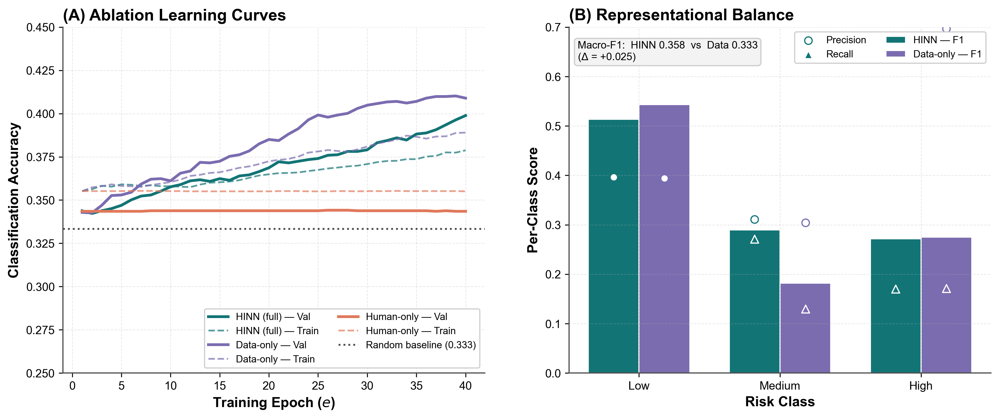

<sub><i><b>(A)</b> Validation accuracy across training epochs. The human-only model plateaus near chance while HINN keeps improving. <b>(B)</b> Per-class F1: HINN substantially improves the Medium-risk class.</i></sub>
</div>

<br>

<div align="center">
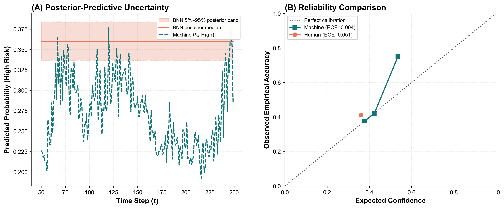

<sub><i><b>(A)</b> BNN posterior band (5–95%) against the machine's high-risk probability. <b>(B)</b> Reliability diagram: the machine pathway sits close to perfect calibration.</i></sub>
</div>

---

## 🖼️ Figure Gallery

<table>
<tr>
<td width="50%" align="center">
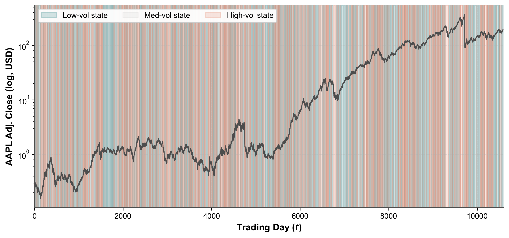<br>
<sub><b>43 years of AAPL</b> (log price) coloured by rolling volatility regime</sub>
</td>
<td width="50%" align="center">
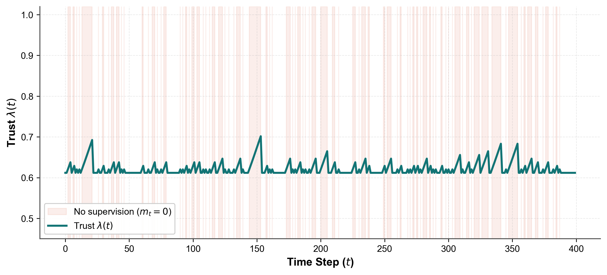<br>
<sub><b>Trust timeline</b>: λ(t) rises during supervision gaps and resets on fresh labels</sub>
</td>
</tr>
<tr>
<td width="50%" align="center">
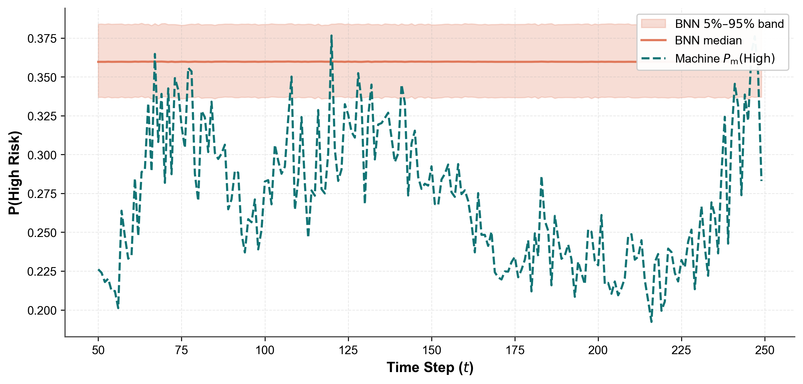<br>
<sub><b>Posterior fan chart</b> from the Bayesian human pathway</sub>
</td>
<td width="50%" align="center">
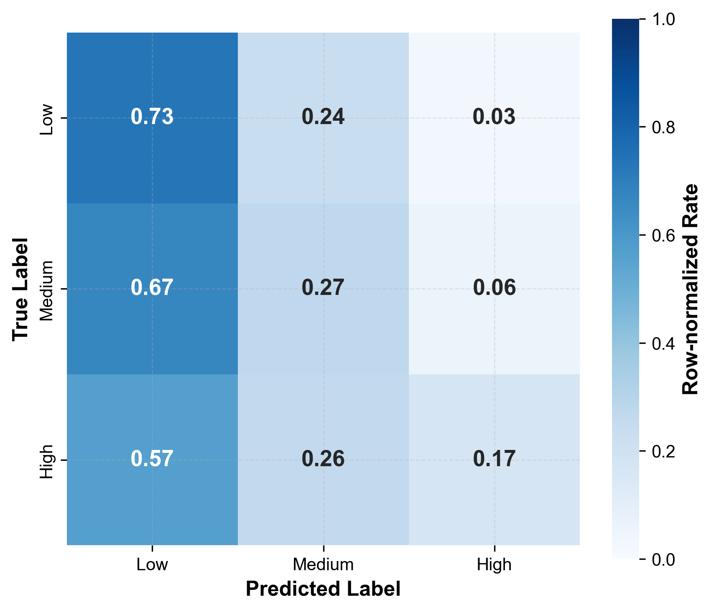<br>
<sub><b>Row-normalised confusion matrix</b> on the validation period</sub>
</td>
</tr>
<tr>
<td width="50%" align="center">
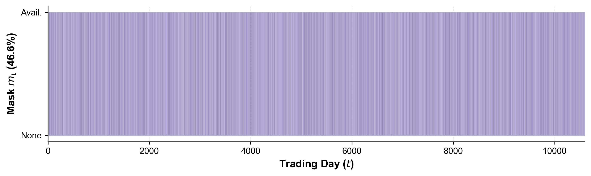<br>
<sub><b>Bursty supervision mask</b>: when human labels are available</sub>
</td>
<td width="50%" align="center">
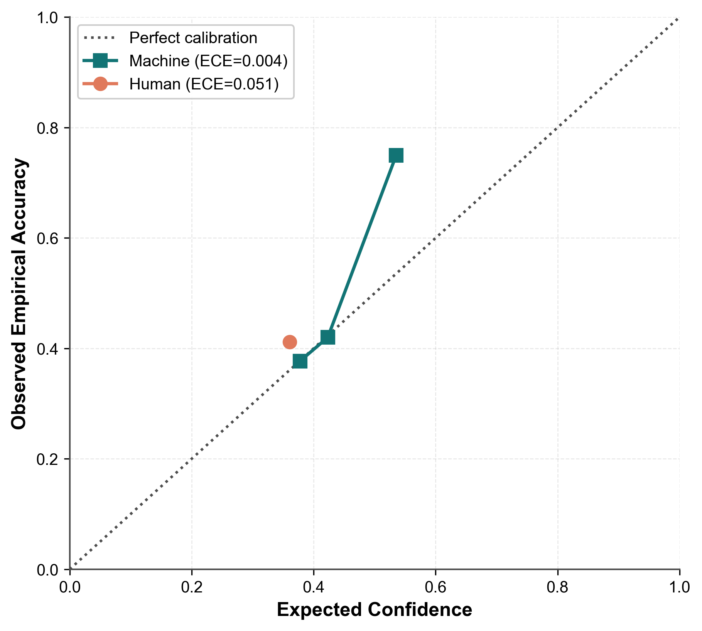<br>
<sub><b>Reliability diagram</b> for calibration analysis</sub>
</td>
</tr>
<tr>
<td width="50%" align="center">
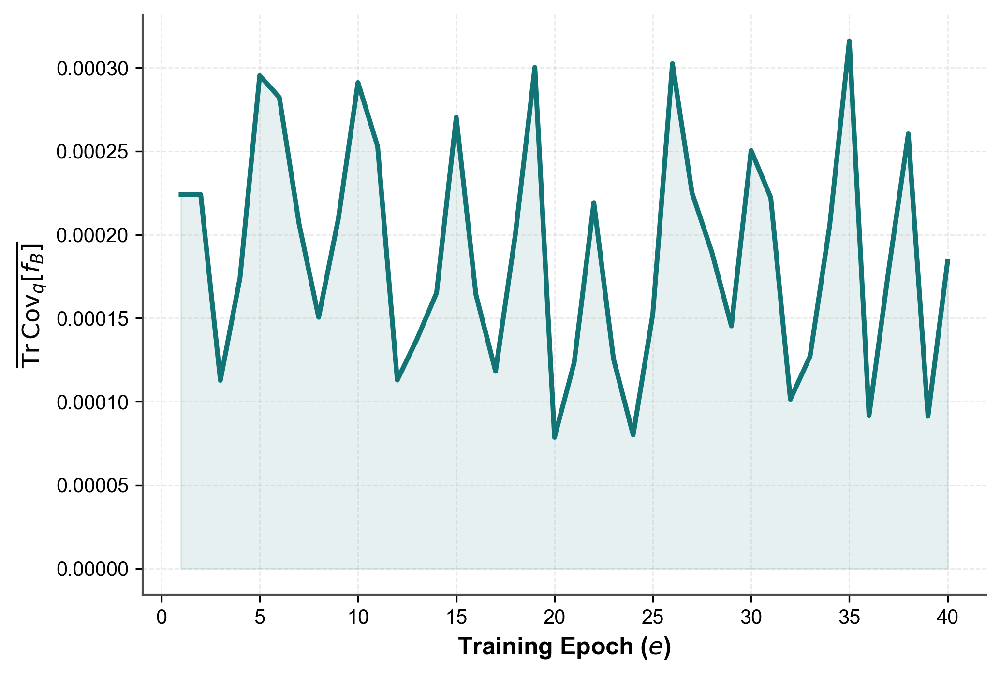<br>
<sub><b>BNN posterior variance</b> trace during training</sub>
</td>
<td width="50%" align="center">
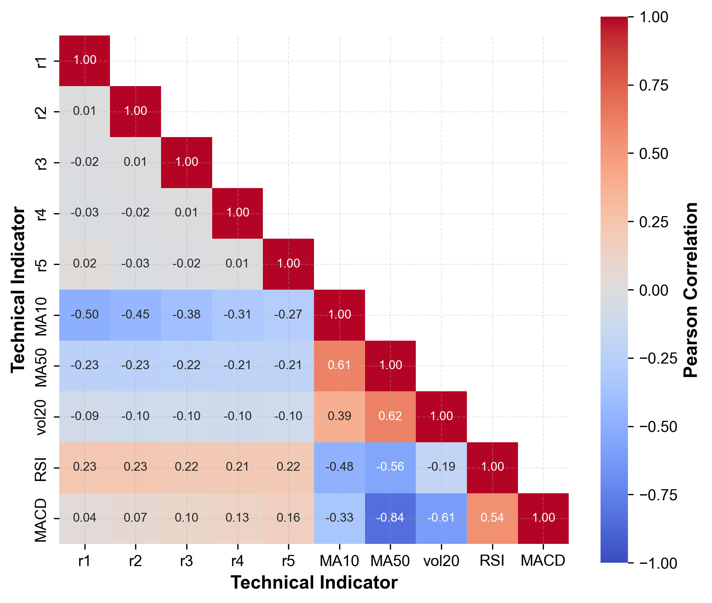<br>
<sub><b>Feature correlation structure</b> of the model inputs</sub>
</td>
</tr>
</table>

<details>
<summary><b>📂 More diagnostics (click to expand)</b></summary>
<br>

<table>
<tr>
<td width="50%" align="center">
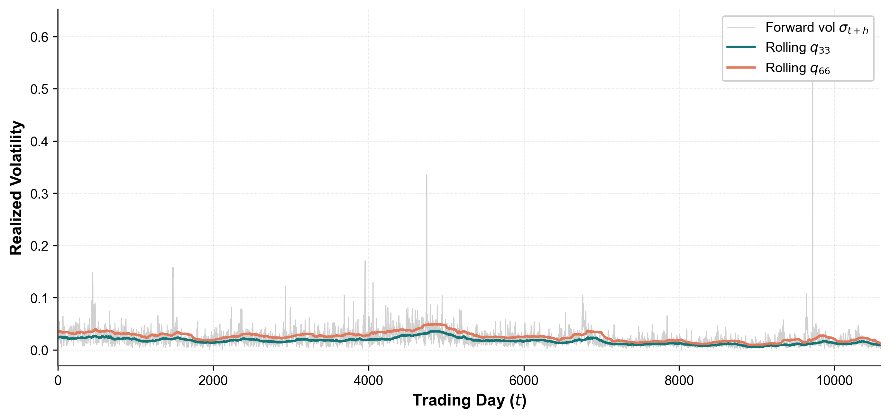<br>
<sub>Rolling volatility quantiles used for adaptive targets</sub>
</td>
<td width="50%" align="center">
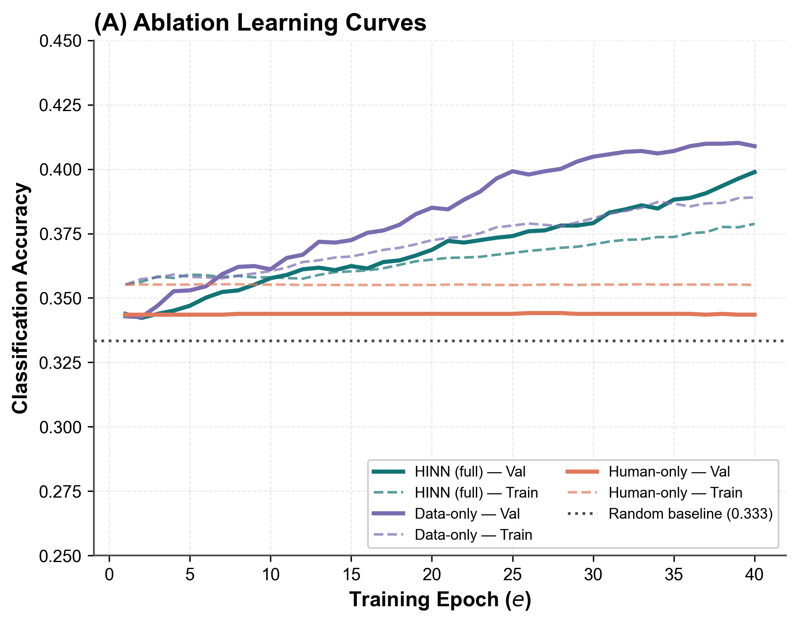<br>
<sub>Learning curves across ablations</sub>
</td>
</tr>
<tr>
<td width="50%" align="center">
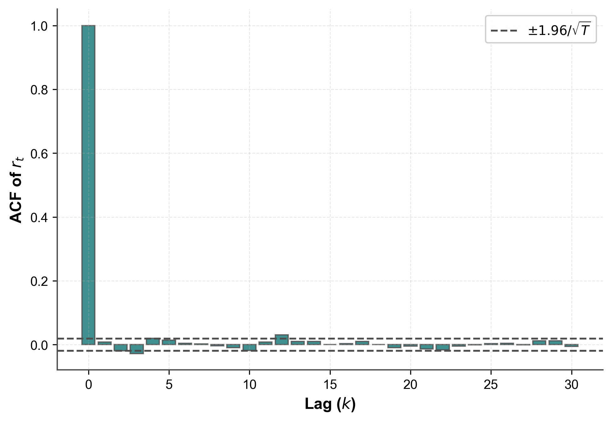<br>
<sub>Autocorrelation of returns</sub>
</td>
<td width="50%" align="center">
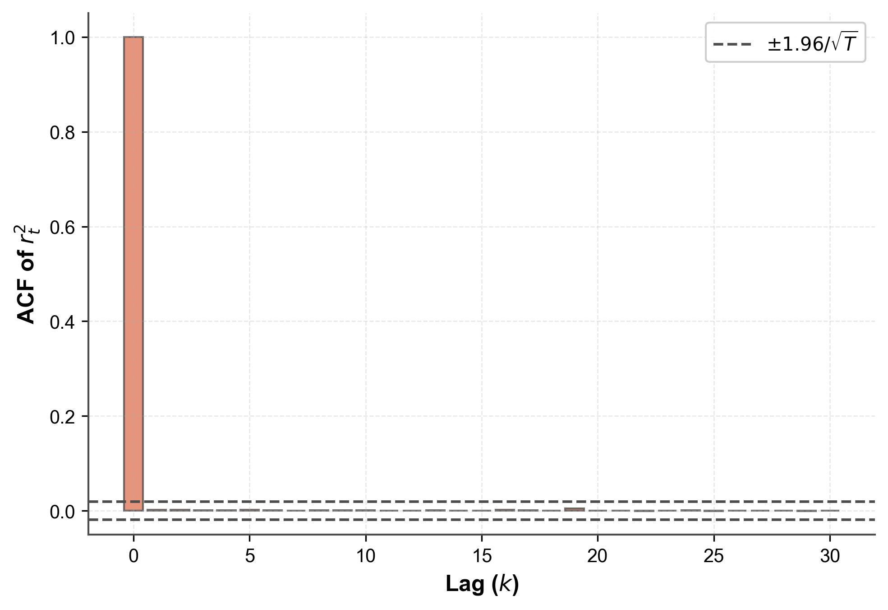<br>
<sub>Autocorrelation of volatility (volatility clustering)</sub>
</td>
</tr>
</table>

</details>

---

## ✨ Features

<table>
<tr>
<td valign="top" width="50%">

**🧩 Model components**
- Elman-style tanh RNN with explicit BPTT
- Mean-field variational BNN with reparameterised MC sampling
- Recency- and uncertainty-sensitive trust routing
- Intermittent label masks, annotation noise, and policy drift

</td>
<td valign="top" width="50%">

**📏 Evaluation toolkit**
- Accuracy, macro-F1, ECE, Brier, multiclass AUC
- Posterior variance, KL divergence, gradient diagnostics
- Data-only and human-only ablation baselines
- Publication-ready plots, CSV metrics, Markdown/LaTeX reports

</td>
</tr>
<tr>
<td valign="top" width="50%">

**🧪 Synthetic benchmark**
- Multi-asset regime-switching market
- GARCH-like volatility dynamics
- Correlated cross-asset shocks

</td>
<td valign="top" width="50%">

**🌍 Real-world benchmark**
- AAPL OHLCV, 1980–2023
- Chronological splitting
- Rolling volatility-risk targets

</td>
</tr>
</table>

---

## 📦 Installation

**Requirements:** Python ≥ 3.9 · NumPy · pandas · scikit-learn · Matplotlib · seaborn

```bash
git clone https://github.com/MBJamshidi/Human-Informed-Neural-Networks-HINN.git
cd Human-Informed-Neural-Networks-HINN
python -m venv .venv
```

<details open>
<summary><b>🐧 Linux / 🍎 macOS</b></summary>

```bash
source .venv/bin/activate
python -m pip install --upgrade pip
python -m pip install -e .
```
</details>

<details>
<summary><b>🪟 Windows PowerShell</b></summary>

```powershell
.\.venv\Scripts\Activate.ps1
python -m pip install --upgrade pip
python -m pip install -e .
```
</details>

You can also install only the runtime dependencies:

```bash
python -m pip install -r requirements.txt
```

> [!NOTE]
> Fresh ingestion from the external FNSPID dataset may require the optional Hugging Face `datasets` package and network access. The processed case-study inputs already in this repository do **not** require re-ingestion.

---

## 🚀 Quick Start

```bash
# 1️⃣ Run the full synthetic workflow
hinn-simulate                 # or: python -m hinn   |   python main.py

# 2️⃣ Run the recommended real-world AAPL case study
python real_world_fnspid/run_hinn_aapl_rolling.py
```

> ⏱️ These experiments are computational research workloads. Runtime depends on your hardware, and they generate many figures and tables.

---

## 🧪 Synthetic Experiment

`src/hinn/simulation.py` is the reference implementation. It simulates about **five years of daily multi-asset data** with:

- 🔄 a persistent three-state latent market regime
- 🌐 correlated cross-asset shocks
- 📉 GARCH-like volatility dynamics
- 🔢 ten model inputs derived from returns and technical indicators
- 🎯 low / medium / high risk targets from forward realised volatility
- 👤 human annotations with noise, gradual policy drift, and bursty availability
- ✂️ a chronological 70/30 train–validation split

The default run trains the **full HINN**, a **data-only** ablation, and a **human-only** ablation. It produces diagnostics for training dynamics, calibration, uncertainty, trust routing, confusion matrices, robustness, posterior behaviour, and hyperparameter sensitivity.

**Redirecting outputs.** Set `HINN_OUTDIR` to keep generated files in their own folder:

```bash
HINN_OUTDIR=outputs hinn-simulate          # Linux / macOS
```
```powershell
$env:HINN_OUTDIR = "outputs"; hinn-simulate   # Windows PowerShell
```

The run typically writes `data/`, `figures/`, `tables/`, and a generated `REPORT.md`.

---

## 🍎 Real-World AAPL Case Study

`real_world_fnspid/` applies the shared HINN implementation to **10,852 trading days** of AAPL OHLCV data (1980-12-12 → 2023-12-28) derived from the FNSPID research corpus.

| Runner | Target construction | Recommended use |
|:---|:---|:---|
| `run_hinn_aapl.py` | Global volatility terciles | Historical comparison and diagnostic baseline |
| `run_hinn_aapl_rolling.py` ⭐ | Trailing 252-day rolling volatility terciles | **Recommended** non-stationary case study |

The rolling workflow builds locally adaptive targets from historical windows and scales features using the training split only, which limits look-ahead leakage. Its simulated human supervision includes **10% uniform label noise**, **gradual policy drift**, and a seeded **bursty mask with 46.6% coverage**.

```bash
python real_world_fnspid/run_hinn_aapl_rolling.py
python real_world_fnspid/generate_real_world_plots.py
python real_world_fnspid/make_case_figures.py
python real_world_fnspid/make_methodology_figures.py
```

<details>
<summary><b>🔧 Optional data-preparation scripts</b></summary>

```bash
python real_world_fnspid/ingest_fnspid.py
python real_world_fnspid/fetch_aapl_price.py
python real_world_fnspid/filter_aapl_news.py
```

These scripts may download or process external data. Review their configuration and the upstream dataset terms before running them.
</details>

All result CSVs, figures, plot arrays, and a detailed report are committed under [`real_world_fnspid/results/`](real_world_fnspid/results/). They come from the experimental configuration included here and **are not** evidence of trading performance or production readiness.

---

## 📐 Mathematical Overview

<details open>
<summary><b>⚙️ Machine pathway (deterministic RNN)</b></summary>

$$
\begin{aligned}
a_t &= W_{xh}\,x_t + W_{hh}\,h_{t-1} + b_h, & h_t &= \tanh(a_t) \\
z_t &= W_{hy}\,h_t + b_y, & p_t &= \mathrm{softmax}(z_t)
\end{aligned}
$$
</details>

<details open>
<summary><b>🎲 Human pathway (variational BNN)</b></summary>

$$
q(\theta \mid \phi) = \mathcal{N}\!\left(\mu,\ \mathrm{diag}(\sigma^2)\right), \qquad
\theta = \mu + \sigma \odot \epsilon, \quad \epsilon \sim \mathcal{N}(0, I)
$$
</details>

<details open>
<summary><b>⚖️ Trust function</b></summary>

$$
\rho_t = e^{-\gamma\,\Delta t_h}, \qquad
c_t = e^{-\kappa\,\mathrm{tr}(\mathrm{Cov}_q)}, \qquad
\lambda(t) = \lambda_{\min} + (1-\lambda_{\min})\,e^{-\alpha\,\rho_t\,c_t}
$$

Here λ(t) is the **machine/data weight**. Recent, confident guidance makes ρ<sub>t</sub>c<sub>t</sub> large and pushes λ(t) toward λ<sub>min</sub>, which gives the human pathway more influence. Stale or uncertain guidance pushes λ(t) toward 1 and restores machine-dominant learning.
</details>

<details open>
<summary><b>🎯 Joint objective</b></summary>

$$
\mathcal{L}_{\text{HINN}} = \sum_t \Big[\, \lambda(t)\,\mathcal{L}_{\text{data}}(t) + \big(1-\lambda(t)\big)\, m_t\, \mathbb{E}_q\!\left[\mathcal{L}_{\text{human}}(t)\right] \Big] + \beta\, \mathrm{KL}\!\left(q(\theta\mid\phi)\,\|\,p(\theta)\right)
$$

m<sub>t</sub> masks out time steps with no human label, and the KL term regularises the variational posterior. The full formulation is in the associated paper and in `src/hinn/simulation.py`.
</details>

---

## 🐍 Python API

```python
from hinn import (
    RNNMachine,                   # deterministic machine pathway
    BNNHuman,                     # variational human pathway
    trust_lambda,                 # recency + confidence trust routing
    train_hinn,                   # joint trust-adaptive training loop
    generate_financial_dataset,   # synthetic regime-switching market
    make_labels,                  # volatility-risk targets
    expected_calibration_error,   # ECE metric
)
```

> The experiment runner is the most stable interface. The lower-level research API may still change while the project is in an early research stage.

---

## 🗂️ Repository Layout

```text
.
├── 📄 README.md
├── 📜 LICENSE
├── ⚙️ pyproject.toml
├── 📋 requirements.txt
├── ▶️ main.py
├── 📁 src/hinn/
│   ├── __init__.py
│   ├── __main__.py
│   └── simulation.py              ← reference implementation
└── 📁 real_world_fnspid/
    ├── run_hinn_aapl.py
    ├── run_hinn_aapl_rolling.py   ← recommended case study
    ├── ingest_fnspid.py
    ├── fetch_aapl_price.py
    ├── filter_aapl_news.py
    ├── generate_real_world_plots.py
    ├── make_case_figures.py
    ├── make_methodology_figures.py
    ├── 📁 data/                   ← processed AAPL inputs
    └── 📁 results/                ← metrics, figures, reports
```

---

## 🔁 Reproducibility

- ✅ Every experiment seeds its random-number generators
- ✅ Train/validation splits are chronological, never shuffled
- ✅ The real-world workflow fits feature scaling on the training split only
- ✅ Processed AAPL inputs and case-study outputs are committed so they can be audited
- ℹ️ Synthetic outputs are git-ignored because they can be regenerated
- ℹ️ Hardware, dependency versions, and platform numerics may shift results slightly

For rigorous comparisons, work in an isolated environment, record the commit hash and package versions, and report every change to seeds, data, targets, trust parameters, or training settings.

---

## ⚠️ Limitations and Responsible Use

- 🧪 HINN is a research prototype and has **not** been certified for safety-critical deployment.
- 👥 The human labels here are **simulated proxies**, not judgements from a clinical, regulatory, or financial expert panel.
- 🎲 Bayesian predictive uncertainty depends on the model and **does not guarantee correctness**.
- 🛟 Graceful fallback reduces the influence of stale or uncertain supervision. It does **not** protect against every kind of biased, adversarial, or confidently wrong feedback.
- 📉 The AAPL study evaluates **volatility-risk classification**. It does not measure returns, execution costs, portfolio performance, or trading profitability.
- 🌍 Results on one asset or one synthetic environment do not show that HINN generalises to other domains.
- 🏛️ Production use requires independent validation, data-governance controls, monitoring, security review, fairness assessment, and accountable human oversight.

---

## 🚧 Project Status

HINN is research software under active development, so interfaces, experiment settings, and output formats may change. Issues and reproducible research contributions are welcome. When reporting a problem, please include your **environment, data provenance, seed, command, expected behaviour, and observed behaviour**.

---

## 📚 Citation

If this repository contributes to a publication, thesis, report, software product, dataset, experiment, or derivative implementation, please cite:

> Mohammad (Behdad) Jamshidi, "Human-Informed Neural Networks (HINNs): Trust-Adaptive Learning with Expert Guidance," *Human-Centric Intelligent Systems*, 2667-1336, 2026. DOI: [10.1007/s44230-026-00173-2](https://doi.org/10.1007/s44230-026-00173-2)

```bibtex
@article{jamshidi2026hinn,
  author  = {Jamshidi, Mohammad (Behdad)},
  title   = {Human-Informed Neural Networks (HINNs): Trust-Adaptive Learning with Expert Guidance},
  journal = {Human-Centric Intelligent Systems},
  year    = {2026},
  doi     = {10.1007/s44230-026-00173-2},
  url     = {https://github.com/MBJamshidi/Human-Informed-Neural-Networks-HINN}
}
```

Once a volume, issue, or final page range is available, use the publisher's final bibliographic record instead of this provisional entry.

---

## 📜 License

The software is released under the [MIT License](LICENSE). Dataset files and upstream sources may have their own terms, and users are responsible for checking and complying with them.

---

<div align="center">

**If HINN is useful in your research, please ⭐ star the repository and cite the paper.**

<sub>Developed by <b>Mohammad (Behdad) Jamshidi</b> · University of Technology Sydney</sub>

</div>
